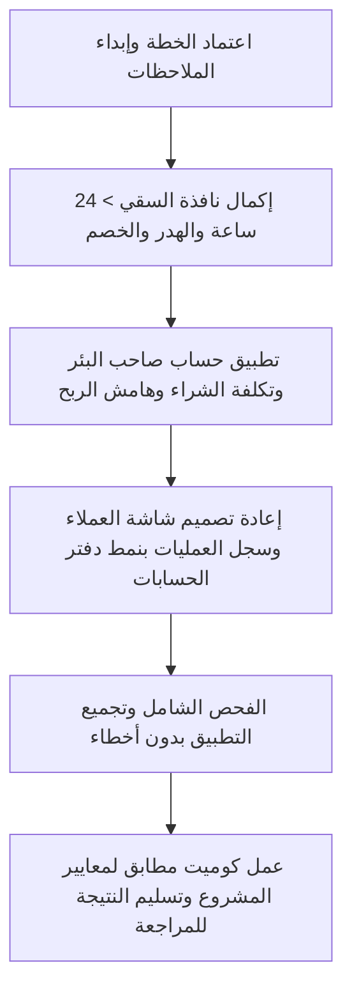

# 📋 وثيقة خطة التطوير الشاملة — تطبيق المُسَرِّب (Mosarib)

**تاريخ الخطة:** 2026-10-10  
**المشروع:** تطبيق المُسَرِّب لإدارة سقي الآبار والحسابات الميدانية  
**المطور المسؤول:** م. عمر الحومي (`oh`)  
**الفرع الحالي:** `feature/oh/MOS-001-base`  
**الحالة:** 🟡 بانتظار مراجعة وتعليقات المستخدم واعتمادها

---

## 🧭 مقدمة وهدف الخطة
تهدف هذه الخطة إلى إجراء نقلة نوعية شاملة لتطبيق "المُسَرِّب" ليصبح الأداة الميدانية الأولى للمسربين وأصحاب الآبار، مستوحين أفضل الممارسات الميدانية وتجربة المستخدم من تطبيق **"دفتر الحسابات"** (الأكثر شهرة واعتماداً لدى المسربين)، مع معالجة كافة المشاكل الفنية السابقة (النسخ الاحتياطي، حماية النسخة التجريبية، والعمليات التي تتجاوز 24 ساعة).

---

## 📊 حالة التنفيذ الحالية (ما تم إنجازه تحت الغطاء)

| المحور | ما تم إنجازه في الكود | المتبقي للاكتمال | الحالة |
| :--- | :--- | :--- | :---: |
| **قاعدة البيانات (Room v3)** | إضافة `wastedMinutes`، `discountAmount`، `costPricePerHour`، وتجهيز `MIGRATION_2_3` الآمن بدون فقد بيانات. | — | ✅ منجز |
| **النسخ الاحتياطي (SAF)** | إضافة منتقي ملفات أندرويد الرسمي `CreateDocument`، إصلاح استيراد العملاء المؤرشفين، والمشاركة المباشرة عبر واتساب. | اختبار الاستعادة التلقائية مع قاعدة v3 | 🟡 90% |
| **حماية النسخة التجريبية** | بناء البصمة العتادية المشفرة SHA-256، وحفظ التوقيع في التخزين الخارجي الدائم لمنع تكرار الـ 200 عملية عند مسح البيانات. | ربطه بإنشاء أول حساب عميل | 🟡 85% |
| **السقي > 24 ساعة والهدر** | تعديل الـ ViewModel والـ Entity لحساب الفرق الزمني بين تاريخين بالدقائق، وخصم الهدر ومبلغ المسامحة. | إكمال واجهة إدخال التواريخ `AddEditSessionBottomSheet` | 🟡 60% |
| **حساب صاحب البئر** | إضافة بيانات صاحب البئر وسعر تكلفة الشراء، ومعادلة احتساب صافي الربح. | شاشة كشف حساب صاحب البئر وتعديل إعدادات الآبار | ⏳ 40% |
| **واجهات دفتر الحسابات** | وضع الهيكل المقترح للكثافة العالية وتصغير الخطوط والشريط السفلي. | تطبيق التصميم الجديد على شاشات العملاء والعمليات | ⏳ 30% |

---

## 📌 المحاور التفصيلية للتعليق والاعتماد

---

### 1️⃣ المحور الأول: دعم السقي لأكثر من 24 ساعة (تحديد تاريخ وساعة البدء والانتهاء)
- [x] **المشكلة:** حالياً التطبيق يحدد فقط وقت البدء ووقت الانتهاء ضمن نفس اليوم، فإذا استمر السقي من الجمعة 8 صباحاً إلى السبت 10 صباحاً (26 ساعة)، يحسبها خطأً ساعتين فقط.
- [ ] **الحل المقترح:**
  1. نافذة السقي تتيح خيارين مرنين:
     * **الخيار (أ) - بالتقويم والساعة:** اختيار تاريخ ووقت البدء + تاريخ ووقت الانتهاء (حساب تلقائي دقيق للمدة الإجمالية مهما بلغت الأيام).
     * **الخيار (ب) - بالمدة المباشرة:** كتابة عدد الساعات والدقائق مباشرة (مثلاً: 26 ساعة و 30 دقيقة) وتحديد وقت البدء، ليتحدد وقت الانتهاء تلقائياً.
  2. تحديث السندات وفواتير الواتساب لتوضيح: `من: الجمعة 2026/10/10 08:00 ص إلى: السبت 2026/10/11 10:00 ص (26 ساعة)`.

> 💬 **مساحة لتعليقك / ملاحظاتك:**  
> *(هل تفضل نمط التقويم أم كتابة الساعات مباشرة أم كلاهما معاً في واجهة السقي؟)*  
> `...`

---

### 2️⃣ المحور الثاني: الوقت المهدور (التوقفات) وحقل الخصم والمسامحة
- [ ] **الواقع الميداني:**
  * أثناء السقي قد تتوقف المضخة لساعة أو ساعتين بسبب عطل، نقص ديزل، أو صيانة. هذا الوقت يجب خصمه من الساعات المحتسبة على المزارع.
  * في نهاية الحساب، قد يتنازل المسرب عن مبلغ بسيط (مثلاً إذا الحساب 10,500 ريال يخصم 500 ريال كمسامحة).
- [ ] **المعادلة المعتمدة:**
  * $\text{المدة الإجمالية} = \text{وقت الانتهاء} - \text{وقت البدء}$
  * $\text{المدة الصافية (المفوترة)} = \max(0, \text{المدة الإجمالية} - \text{الوقت المهدور})$
  * $\text{قيمة الماء الإجمالية} = (\text{الساعات الصافية} \times \text{سعر بيع الساعة})$
  * $\text{المطلوب الصافي} = \max(0, \text{قيمة الماء} - \text{مبلغ الخصم والمسامحة})$
  * $\text{المتبقي في ذمة المزارع (دين)} = \text{المطلوب الصافي} - \text{المدفوع فوراً}$
- [ ] **ظهور البيان في الفاتورة والواتساب:**
  * يظهر بالتفصيل: *(إجمالي الوقت: 26 ساعة | وقت مهدور: ساعتان | الصافي: 24 ساعة | الخصم: 500 ريال | المطلوب: 11,500 ريال)*.

> 💬 **مساحة لتعليقك / ملاحظاتك:**  
> *(هل تريد حقل سبب الهدر اختيارياً أم إلزامياً؟ وهل الخصم يكون مبلغاً نقدياً أم نسبة مئوية؟)*  
> `...`

---

### 3️⃣ المحور الثالث: حساب صاحب البئر (سعر الشراء وهامش ربح المسرب)
- [ ] **آلية العمل التجاري:**
  * المسرب يشتري الماء من صاحب البئر بسعر الجملة (مثلاً 3,000 ريال/ساعة).
  * المسرب يبيع للمزارع بسعر التوزيع (مثلاً 5,000 ريال/ساعة).
  * هامش ربح المسرب = 2,000 ريال لكل ساعة.
  * صاحب البئر له مستحقات في ذمة المسرب (دين على المسرب لصالح صاحب البئر) تسدد عبر دفعات وسندات صرف.
- [ ] **التعديلات:**
  1. شاشة مصادر الآبار: إضافة حقل **(اسم صاحب البئر)** و **(رقم هاتفه)** و **(سعر الشراء للساعة)**.
  2. في كل دورة سقي: يتم تلقائياً احتساب التكلفة لصاحب البئر = $\text{الساعات الصافية} \times \text{سعر الشراء}$.
  3. كشف حساب صاحب البئر:
     * **له:** مجموع قيمة الساعات المأخوذة من بئره.
     * **عليه:** المبالغ النقدية والحوالات المسددة له من المسرب.
     * **الرصيد:** المتبقي له في ذمة المسرب (عليك لصاحب البئر).
  4. تقرير الأرباح الصافية للمسرب: يعرض إجمالي المبيعات - تكلفة الآبار - المصاريف = صافي أرباح المسرب الفعلية.

> 💬 **مساحة لتعليقك / ملاحظاتك:**  
> *(هل تريد أن يظهر صاحب البئر كحساب مستقل في قائمة الحسابات الرئيسية مع تمييزه بلون خاص، أم في قسم خاص بالآبار فقط؟)*  
> `...`

---

### 4️⃣ المحور الرابع: الإصلاح الجذري للنسخ الاحتياطي
- [x] **سبب المشكلة السابقة:**
  1. خاصية درايف السابقة كانت تفشل بخطأ `DEVELOPER_ERROR 10` بسبب غياب مفاتيح Google Cloud Console.
  2. الحفظ المباشر في التنزيلات يفشل في أندرويد 11+ بسبب قيود Scoped Storage.
  3. استعادة النسخة كانت تفشل عند وجود عملاء مؤرشفين مرتبطين بعمليات.
- [x] **الحل الجذري المنجز:**
  1. **نظام منتقي الملفات الرسمي (Android Storage Access Framework):** زر "حفظ نسخة احتياطية" يفتح نافذة النظام الرسمية ليختار المسرب أي مكان يريده (ذاكرة الهاتف، مجلد المستندات، بطاقة SD، أو مجلد درايف المثبت على هاتفه) ويحفظ الملف مباشرة.
  2. **زر "مشاركة النسخة الاحتياطية":** يفتح قائمة المشاركة الرسمية لإرسال ملف النسخة مباشرة بنقرة واحدة إلى واتساب، تيليجرام، أو البريد.
  3. **استيراد متوافق وآمن 100%:** دعم استيراد النسخ القديمة والجديدة بدون فقد لأي بيانات أو أخطاء قيود.

> 💬 **مساحة لتعليقك / ملاحظاتك:**  
> *(هل ترغب في إضافة ميزة تذكير دوري لعمل نسخة احتياطية كل أسبوع أو شهر؟)*  
> `...`

---

### 5️⃣ المحور الخامس: حماية النسخة التجريبية من إعادة الاستخدام على نفس الهاتف
- [x] **تحليل الثغرة:** المستخدم كان يقوم بعمل "مسح بيانات التطبيق" (Clear Data) أو إعادة تثبيته، فيُعاد تصفير عداد العمليات ويحصل على 200 عملية مجانية من جديد.
- [x] **الحل الفني المنجز:**
  1. **البصمة العتادية المشفرة:** استخراج معرف فريد عتادي للهاتف `SHA-256(Hardware + Board + AndroidID)`.
  2. **التوقيع الخارجي الدائم المستمر:** حفظ ملف توقيع مشفر ومخفي في ذاكرة الجهاز المشتركة لا يحذفه مسح بيانات التطبيق.
  3. **التحقق الفوري عند التثبيت:** بمجرد فتح التطبيق لأول مرة بعد مسح البيانات، إذا وجد التوقيع السابق لنفس الهاتف يمنع إعطاء 200 عملية جديدة ويطلب كود التفعيل فوراً.
  4. **عداد تصاعدي لا ينقص:** حذف العمليات القديمة من قبل المستخدم لا يعيد له رصيد العمليات التجريبية.

> 💬 **مساحة لتعليقك / ملاحظاتك:**  
> *(هل حد الـ 200 عملية تجريبية مناسب أم ترغب بتعديله؟)*  
> `...`

---

### 6️⃣ المحور السادس: النقلة النوعية في الواجهات (اقتباس نموذج دفتر الحسابات وعلاج النصوص الكبيرة)
- [ ] **عناصر الاقتباس من تطبيق "دفتر الحسابات" (المرفق في الصورة):**
  1. **كثافة المعلومات والسرعة (Compact List):**
     * تحويل البطاقات الكبيرة المتباعدة إلى أسطر مدمجة أنيقة وسريعة.
     * كل عميل يظهر في سطر واحد فقط:
       * اسم المزارع بخط واضح ومريح.
       * شارة زرقاء أنيقة بعدد العمليات (مثلاً: `10` أو `42`).
       * المبلغ المالي مع أيقونة اتجاه ملونة:
         * **سهم أحمر للأسفل 🔻**: عليه (مدين للمسرب).
         * **سهم أخضر للأعلى 🔺**: له (دائن / دافع مقدماً).
       * **زر `+` سريع في نهاية كل سطر:** بمجرد لمسه تفتح نافذة سريعة لإضافة سقية أو سند قبض لهذا المزارع فوراً دون الحاجة للدخول لصفحته أولاً.
  2. **الشريط المالي السفلي الثابت (Floating Bottom Summary Bar):**
     * شريط سفلي دائم يعرض بوضوح وبألوان متناسقة:
       * **عليك (لأصحاب الآبار):** `X,XXX ريال`
       * **لك (على المزارعين):** `Y,YYY ريال`
       * زر دائري مركزي `+` لإضافة حساب جديد أو حركة سريعة.
  3. **سجل العمليات المقتضب (Ledger Density):**
     * في كشف حساب المزارع: أسطر مدمجة تعرض كل عملية في سطرين صغيرين:
       * سطر 1: التاريخ والوقت + البيان المختصر (سقي 24 س - هدر ساعتين).
       * سطر 2: المبلغ الصافي + الرصيد التراكمي بعد العملية + نوع الحركة (له / عليه).
  4. **علاج النصوص الكبيرة وتناسق الخطوط:**
     * ضبط أحجام العناوين والنصوص لتناسب شاشات الهواتف المختلفة، ومنع تقطيع الأسماء الثلاثية والرباعية للمزارعين.

> 💬 **مساحة لتعليقك / ملاحظاتك:**  
> *(هل تفضل أن يكون الشريط السفلي يحتوي على: "عليك" و "لك" ورصيد الصافي؟)*  
> `...`

---

## 🚀 خطة التنفيذ المتبقية (مرحلة بمرحلة)

---

## ✍️ خانة القرار والموافقة

يرجى تزويدنا بملاحظاتك على البنود أعلاه، أو كتابة **"معتمد، ابدأ التنفيذ"** للبدء فوراً في إكمال الخطوات تباعاً.
